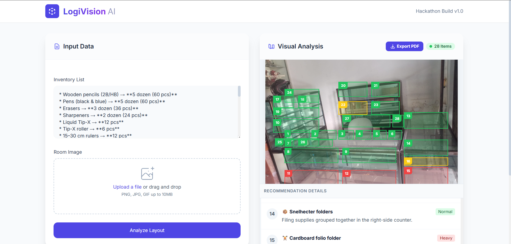

# 📦 LogiVision AI - Smart Inventory Placement System

LogiVision is an AI-powered logistics assistant designed for Hackathons. It helps users organize their storage spaces (warehouses, retail shelves, or home storage) by analyzing photos and inventory lists using the Gemini AI model.

 <!-- Placeholder for actual screenshot if available -->

## 🚀 Features

- **AI Room Analysis**: Automatically detects suitable placement spots for items in a room photo.
- **Smart Logic**: Prioritizes safety and physics (Heavy items on the floor, fragile items on top shelves).
- **Interactive Visual Overlays**: 
    - Hover over boxes in the image to highlight the item details.
    - Hover over the list to find the corresponding box in the image.
- **Modern Dashboard**: Built with a clean, responsive "Modern Dashboard" aesthetic using Tailwind CSS.
- **Professional PDF Export**: Generate high-quality, multi-page PDF reports for offline use, including the annotated image and detailed recommendations.

## 🛠️ Tech Stack

- **Framework**: Laravel 10
- **AI Model**: Google Gemini 3 Flash
- **Frontend**: Tailwind CSS (via CDN)
- **JavaScript Libraries**:
    - `html2canvas`: For capturing the visual analysis.
    - `jsPDF`: For generating professional document reports.
- **API**: Google Generative Language API (`Http` client).

## 📋 Requirements

- PHP >= 8.1
- Composer
- Google Gemini API Key ([Get it here](https://aistudio.google.com/))

## ⚙️ Installation

1. **Clone the repository**:
   ```bash
   git clone <your-repo-url>
   cd LogiVision
   ```

2. **Install dependencies**:
   ```bash
   composer install
   npm install && npm run dev
   ```

3. **Configure Environment**:
   Copy the `.env.example` to `.env` and add your Gemini API Key.
   ```bash
   cp .env.example .env
   ```
   Edit `.env`:
   ```env
   GEMINI_API_KEY=your_api_key_here
   ```

4. **Generate Application Key**:
   ```bash
   php artisan key:generate
   ```

5. **Run the Application**:
   ```bash
   php artisan serve
   ```
   Visit `http://127.0.0.1:8000` in your browser.

## 💡 How to Use

1. **Upload a Photo**: Take a photo of your empty shelf, room, or warehouse space.
2. **List your Items**: Enter your inventory list (e.g., "3 heavy boxes of ceramic tiles, 1 glass vase, 5 bags of cement").
3. **Analyze**: Click "Analyze Layout".
4. **Interact**: Use the visual overlays to understand the suggestions.
5. **Export**: Click "Export PDF" to save the report for offline use.

## 📄 License

The Laravel framework is open-sourced software licensed under the [MIT license](https://opensource.org/licenses/MIT).